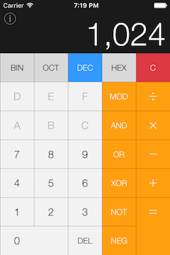
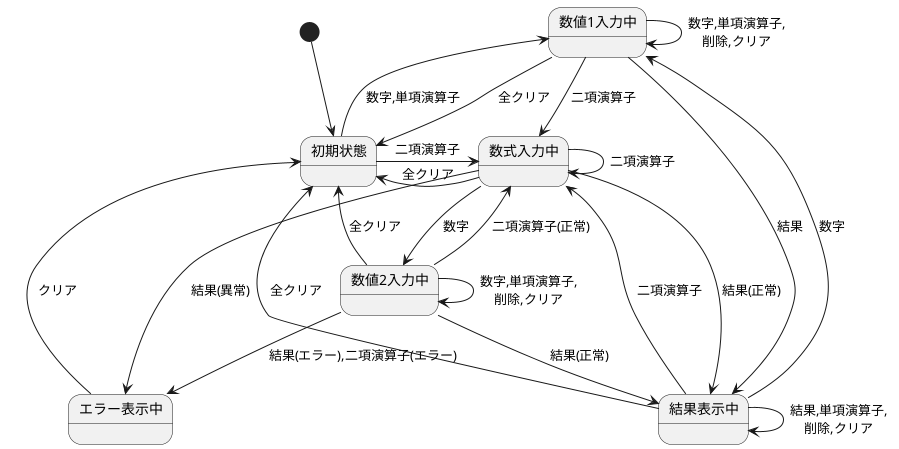
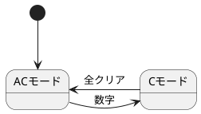

<!--
この Markdown ファイルは Visual Studio Code と以下のプラグインを使って書かれ HTML ファイルへエクスポートしました。
  - Markdown Preview Enhanced by Yiyi Wang
-->

# 16進電卓

これは [16進電卓](https://itunes.apple.com/jp/app/16進電卓/id335773208?mt=8) のキー入力制御に関する仕様メモです。

## 1. 画面レイアウト

 

### 1.1 キー

| **キーの種類**     | キーの画面での名前 |
|--------------------|--------------------|
| **数字キー**       | `0`, `1`, `2`, `3`, `4`, `5`, `6`, `7`, `8`, `9`, `A`, `B`, `C`, `D`, `E`, `F` |
| **単項演算子キー** | `NOT`, `NEG` |
| **二項演算子キー** | `+`, `-`, `×`, `÷`, `MOD`, `AND`, `OR`, `XOR` |
| **結果キー**       | `=` |
| **削除キー**       | `DEL` |
| **クリアキー**     | `C` (赤色) |
| **全クリアキー**   | `AC` |

## 2. 状態遷移図

### 2.1 キー入力全体

### 2.2 クリアキー

## 3. 状態遷移表

|                  | **数字キー** | **単項演算子キー** | **二項演算子キー** | **結果キー** | **削除キー** | **クリアキー** | **全クリアキー** |
|------------------|--------------|--------------------|--------------------|--------------|--------------|----------------|------------------|
| **初期状態**     | 数値1=入力数字 →**数値1入力中へ** | 数値1=入力演算子(数値1) →**数値1入力中へ** | 数値1=0 最終演算子=入力演算子 →**数式入力中へ** | 無視 | 無視 | 無視 | 無視 |
| **数値1入力中**  | 数値1=数値1×基数+入力数字 | 数値1=入力演算子(数値1) | 最終演算子=入力演算子 →**数式入力中へ** | 数値1=最終演算子(数値1,数値2) 成功の時: →**結果表示中へ** 失敗の時: →**エラー表示中へ** | 数値1=数値1÷基数 | 数値1=0 | 数値1=0 数値2=0 →**初期状態へ** |
| **数式入力中**   | 数値2=入力数字 →**数値2入力中へ** | 数値1=入力演算子(数値1) →**数値1入力中へ** | 最終演算子=入力演算子 | 数値1=最終演算子(数値1,数値2) 成功の時: →**結果表示中へ** 失敗の時: →**エラー表示中へ** | 数値1=数値1÷基数 | 数値1=0 | 数値1=0 数値2=0 →**初期状態へ** |
| **数値2入力中**  | 数値2=数値2×基数+入力数字 | 数値2=入力演算子(数値2) | 数値1=最終演算子(数値1,数値2) 最終演算子=入力演算子 成功の時: →**数式入力中へ** 失敗の時: →**エラー表示中へ** | 数値1=最終演算子(数値1,数値2) 成功の時: →**結果表示中へ** 失敗の時: →**エラー表示中へ** | 数値2=数値2÷基数 | 数値2=0 | 数値1=0 数値2=0 →**初期状態へ** |
| **結果表示中**   | 数値1=入力数字 →**数値1入力中へ** | 数値1=入力演算子(数値1) →**数値1入力中へ** | 最終演算子=入力演算子 →**数式入力中へ** | 数値1=最終演算子(数値1,数値2) 成功の時: →**結果表示中へ** 失敗の時: →**エラー表示中へ** | 数値1=数値1÷基数 | 数値1=0 | 数値1=0 数値2=0 →**初期状態へ** |
| **エラー表示中** | 無視 | 無視 | 無視 | 無視 | 無視 | 数値1=0 数値2=0 →**初期状態へ** | 数値1=0 数値2=0 →**初期状態へ** |

以上

---
2018-05-19 H.Ishiura